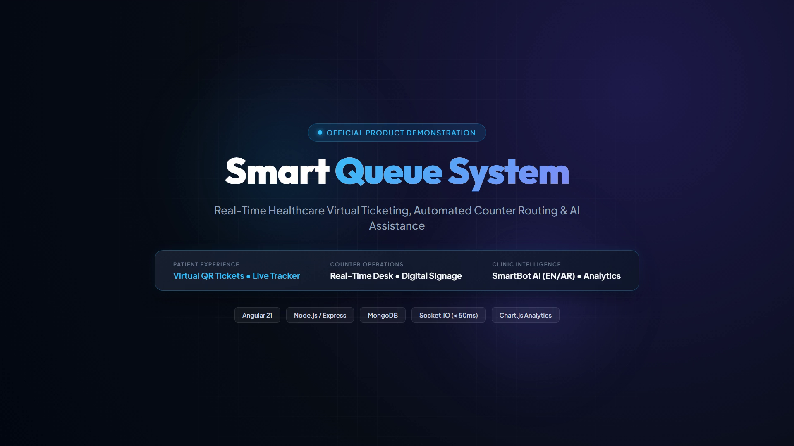
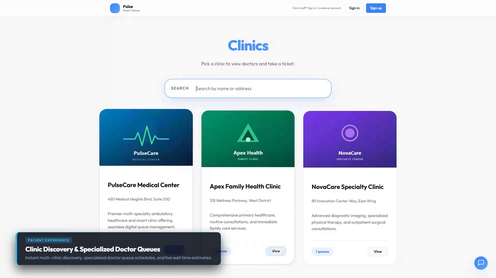
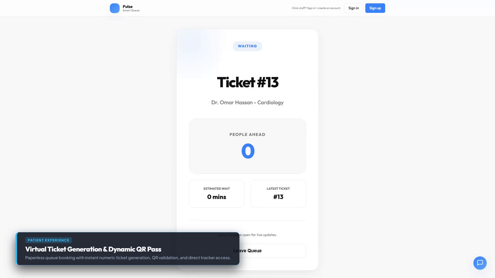
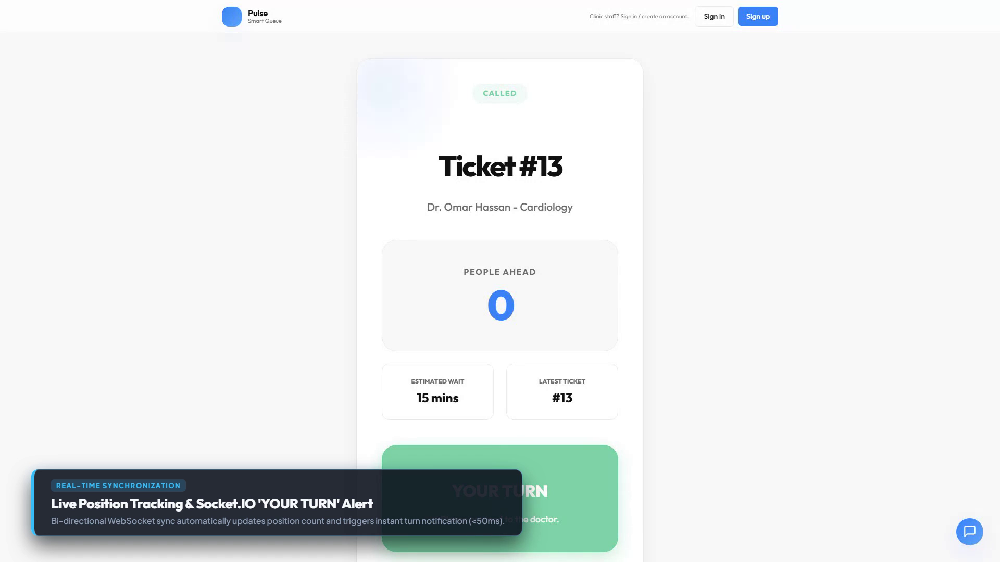
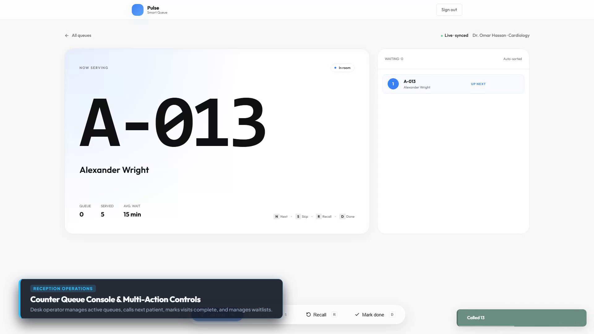
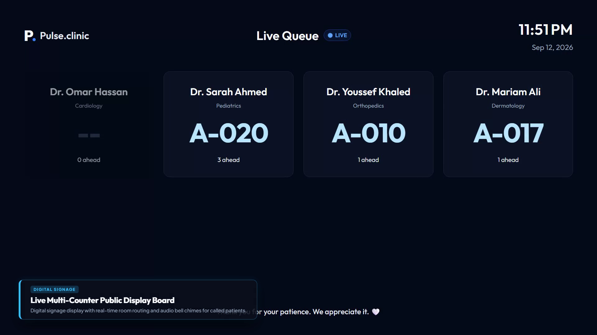
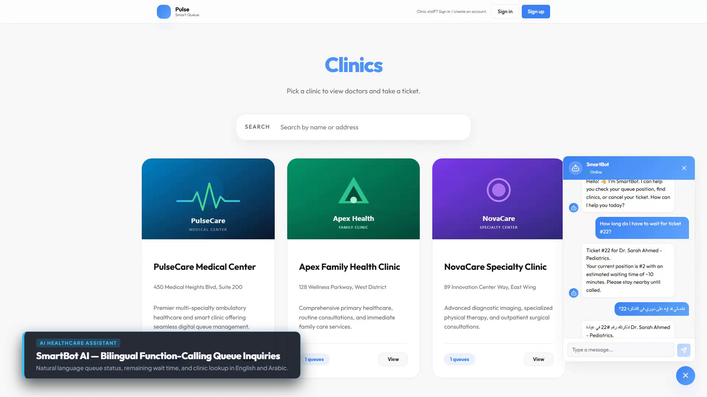
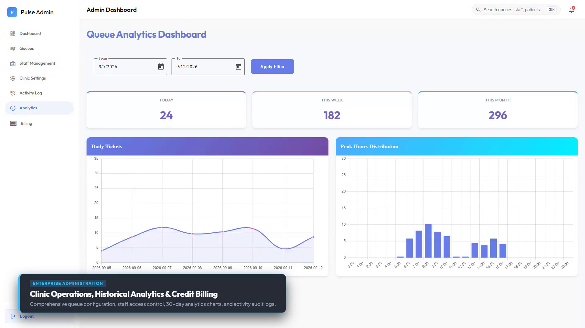

# 🎬 Smart Queue System — Official Product Showcase & Video Demos

> A comprehensive, production-grade video walkthrough of the **Smart Queue System** platform demonstrating real-time patient virtual ticketing, receptionist desk operations, digital waiting room signage, bilingual AI assistance, and executive clinic analytics.

---

## 📺 Official Product Demos
* ☁️ **Google Drive 1080p Mirror:** [Watch / Download on Google Drive](https://drive.google.com/file/d/1CGYDF8LWx9LGvTU2tAurm0xVk6mPdlRJ/view?usp=drive_link)

### 1. Full Platform Walkthrough (1080p 60fps / 30fps)
* **File:** [`demo-output/video/Smart-Queue-System-Full-Demo.mp4`](../video/Smart-Queue-System-Full-Demo.mp4)
* **Duration:** 101 seconds (1m 41s)
* **Scope:** Complete end-to-end healthcare queue lifecycle from patient discovery to real-time doctor call, counter desk controls, public waiting signage, SmartBot AI, and admin portal.

### 2. Fast-Paced Recruiter / Highlights Cut
* **File:** [`demo-output/video/Smart-Queue-System-CV-Demo.mp4`](../video/Smart-Queue-System-CV-Demo.mp4)
* **Duration:** 75 seconds (1m 15s)
* **Scope:** High-tempo overview focusing on core features: dynamic QR ticketing, sub-50ms Socket.IO synchronization, instant "YOUR TURN" alert states, counter desk management, and operational analytics.

---

## 🖼️ Feature Showcase

| Screen | Feature Highlights |
| :--- | :--- |
| **01. Platform Overview**<br> | High-contrast dark glassmorphic design, multi-tenant clinic architecture, Angular 21, Node.js/Express, MongoDB, and Socket.IO. |
| **02. Clinic Discovery**<br> | Real-time multi-clinic search, live queue counts, doctor specialties, and estimated wait times. |
| **03. Virtual QR Ticket**<br> | Instant paperless ticket booking with auto-incremented queue number and scannable QR ticket pass. |
| **04. Live Position Tracker**<br> | Live WebSocket position counter with instant emerald green "YOUR TURN" transition and audio alert. |
| **05. Reception Counter Console**<br> | Real-time counter management with single-click actions (`Call Next`, `Skip`, `Recall`, `Mark Done`). |
| **06. Waiting Room Signage**<br> | Full-screen multi-department display board optimized for waiting room TVs with audio chime routing. |
| **07. SmartBot AI Assistant**<br> | Conversational AI queue assistant powered by function calling with native English and Arabic support. |
| **08. Clinic Admin Analytics**<br> | 30-day ticket volume trends, peak-hour distribution histograms, staff management, and audit logs. |

---

## ⚡ Quickstart: Running the Local Demo

The repository includes a deterministic seeding script and automated Playwright recording pipeline:

```bash
# 1. Clone the repository
git clone https://github.com/MoamenSoltan/Smart-Queue-System.git
cd Smart-Queue-System

# 2. Install dependencies
npm --prefix server install
npm --prefix client install

# 3. Seed deterministic healthcare demo data (PulseCare Medical Center)
node server/scripts/seed-demo.js

# 4. Start local services
# Terminal 1: Backend API (port 3000)
node server/server.js

# Terminal 2: Angular Frontend (port 4200)
npm --prefix client start
```

### Pre-configured Demo Accounts

* **Patient Portal:** `http://localhost:4200/patient` (No login required)
* **Reception Console:** `http://localhost:4200/reception/login`
  * Username: `reception@pulsecare.com` | Password: `password123`
* **Waiting Room Signage:** `http://localhost:4200/reception/display`
* **Admin Portal:** `http://localhost:4200/admin/login`
  * Username: `admin@pulsecare.com` | Password: `password123`
